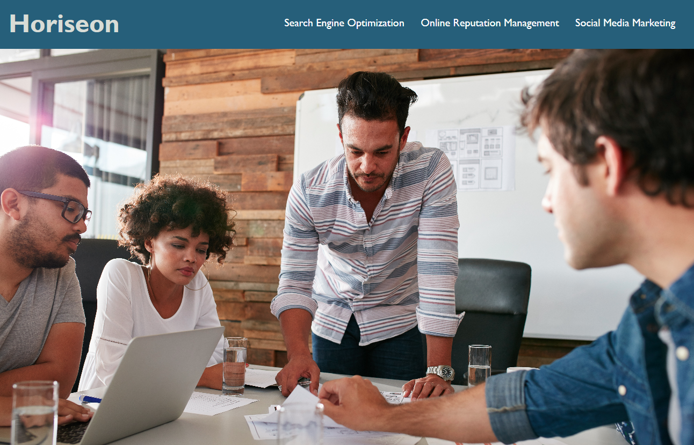
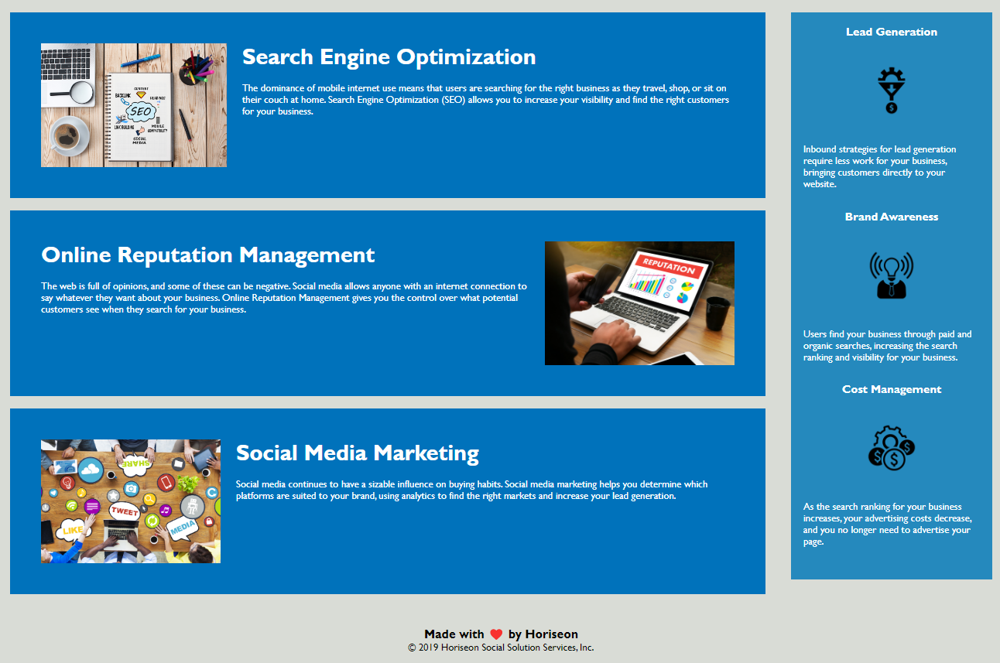

# Horiseon Social Solution Services Website

## Description

The goal of this project was to modify the provided started code to:

1. Meet accessibility standards
2. Add semantic HTML elements
3. Add alt attributes to images
4. Make sure HTML and CSS falls in sequential order
5. Consolidate CSS code
6. Add a concise, descriptive title
7. Add comments to HTML and CSS Code
8. Have completed application resemble provided mockup
9. Create a GitHub repository for the application
10. Deploy the application to a live URL
11. Ensure the application loads with no errors

## Screenshots

### Link to Application

<a href="https://chasediet.github.io/02-Challenge-Horiseon/" target="_blank">Application Link - Open in New Tab</a>
